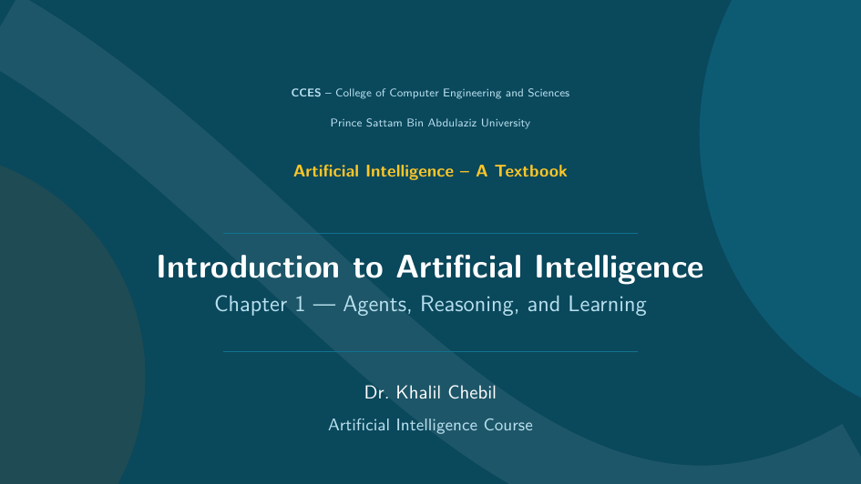

# Chapter 1 — Presentation Slides

:::{admonition} Offline Presentation
:class: tip
This is the **offline slide deck** for Chapter 1, generated in LaTeX (Beamer) using
the course theme. Click the preview to open the full slides in your browser, or use
the download button for offline use, printing, and lecturing.
:::

## View the slides

[](slides/ch01_introduction_slides.pdf)

:::{tip}
Click the preview above to open the **full 31-slide deck** in a new browser tab.
:::

## Download

{download}`⬇ Download Chapter 1 Slides (PDF) <slides/ch01_introduction_slides.pdf>`

You can also open the file directly:
[ch01_introduction_slides.pdf](slides/ch01_introduction_slides.pdf).

## About this deck

The slides cover:

- **What is AI?** — definition, history, roots, the Turing Test, subfields, and risks
- **How to achieve AI** — deductive (phenomenal) vs. inductive (biological) approaches
- **Intelligent Agents** — PEAS, agent types, and environment properties
- **Learning Paradigms** — supervised, unsupervised, and reinforcement learning

:::{note}
The LaTeX source is available in the repository under `latex/ch01.tex` and shares the
common Beamer theme in `latex/theme.tex`. Rebuild with:

```bash
cd latex && pdflatex ch01.tex
```
:::
