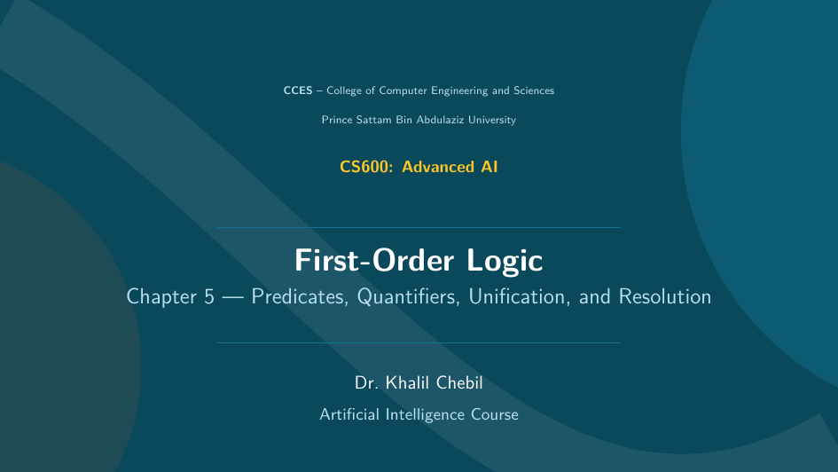

# Chapter 5 — Presentation Slides

:::{admonition} Offline Presentation
:class: tip
This is the **offline slide deck** for Chapter 5, generated in LaTeX (Beamer) using
the course theme. Click the preview to open the full slides in your browser, or use
the download button for offline use, printing, and lecturing.
:::

## View the slides

[](slides/ch05_firstorder_slides.pdf)

:::{tip}
Click the preview above to open the **full slide deck** in a new browser tab.
:::

## Download

{download}`⬇ Download Chapter 5 Slides (PDF) <slides/ch05_firstorder_slides.pdf>`

You can also open the file directly:
[ch05_firstorder_slides.pdf](slides/ch05_firstorder_slides.pdf).

## About this deck

The slides cover:

- **Why FOL & syntax** — objects, relations, functions, predicates, terms
- **Quantifiers & semantics** — ∀/∃, quantifier order, De Morgan, entailment
- **Unification & inference** — substitution, MGU, generalized Modus Ponens, Skolemization
- **Chaining** — forward vs. backward with the ancestor example
- **Resolution** — CNF conversion and a refutation proof

:::{note}
The LaTeX source is available in the repository under `latex/ch05.tex` and shares the
common Beamer theme in `latex/theme.tex`. Rebuild with:

```bash
cd latex && pdflatex ch05.tex
```
:::
